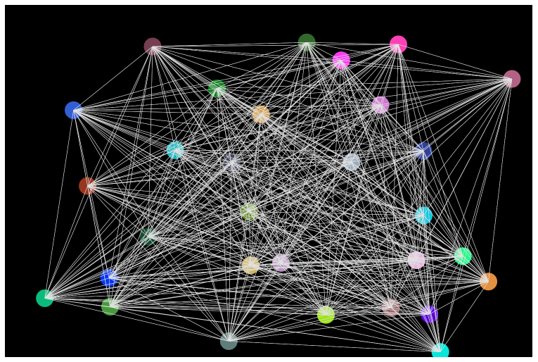
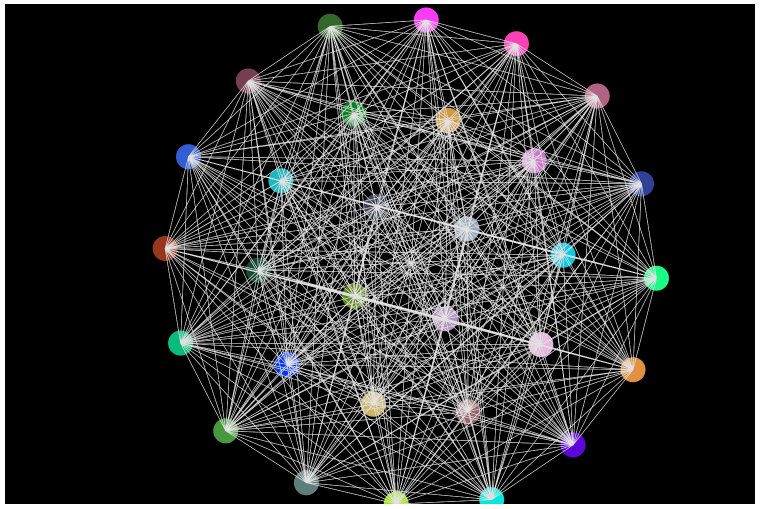

# Force-Directed Graph Visualization    

This project is an interactive Force-Directed Graph implemented using p5.js. Force-directed graphs use physical simulation to position nodes based on their relationships.

## How It Works

The simulation uses the force-directed layout algorithm, where:

1. Nodes repel each other, simulating a repulsive force.
1. Edges act like springs, pulling connected nodes together.

Physics principles (e.g., Hooke's Law for springs and Coulomb's Law for repulsion) are used to achieve a natural layout.

## Screenshots

## Technologies Used

- **Programming Language**: HTML, CSS, JavaScript
- **Library**:  [p5.js](https://p5js.org/) – A JavaScript library for creative coding, perfect for creating interactive visuals and animations.

## Contributing

Contributions are welcome! If you have ideas for new features or improvements, feel free to:

## License

This project is licensed under the [MIT License](LICENSE).

## Contact

For questions or feedback, reach out to [pravats459@gmail.com]().